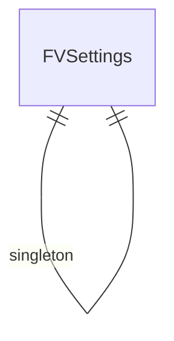

# Frappe Visual — Entity Relationship Diagram
# فريب فيجوال — مخطط العلاقات

> 6 DocTypes

> **Note:** This is a placeholder ERD. Update with actual DocType relationships from the JSON definitions.
> Run: `ls frappe_visual/frappe_visual/*/doctype/` to discover all DocTypes and their Link fields.
