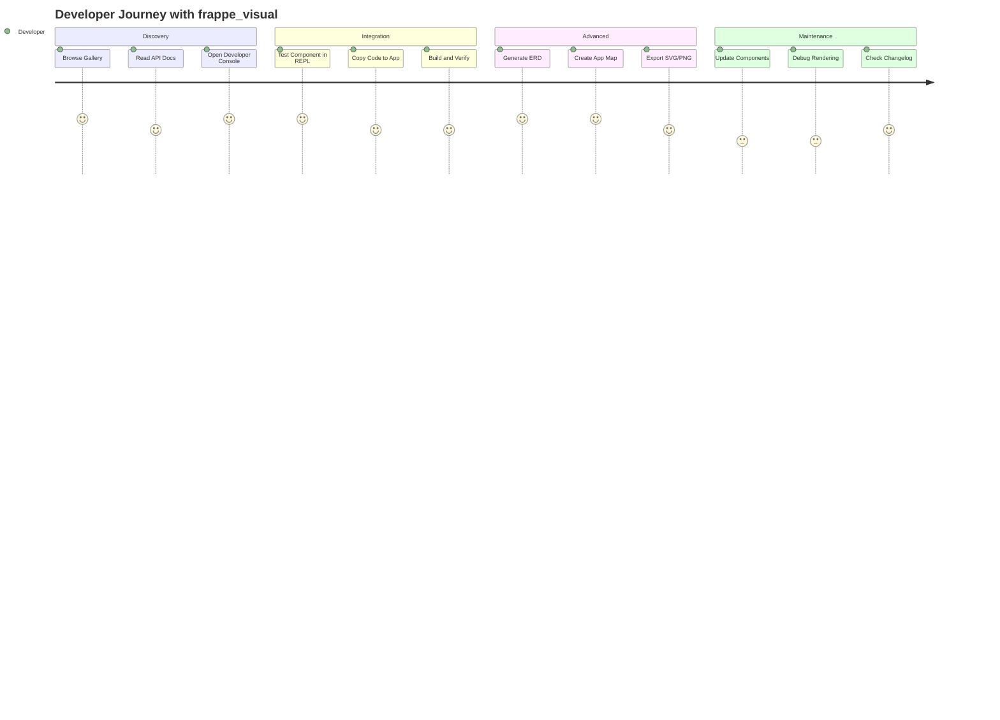

# Developer Journey — رحلة المطور

```mermaid
journey
    title Developer Journey with frappe_visual
    section Discovery
      Browse Gallery: 5: Developer
      Read API Docs: 4: Developer
      Open Developer Console: 5: Developer
    section Integration
      Test Component in REPL: 5: Developer
      Copy Code to App: 4: Developer
      Build and Verify: 4: Developer
    section Advanced
      Generate ERD: 5: Developer
      Create App Map: 5: Developer
      Export SVG/PNG: 4: Developer
    section Maintenance
      Update Components: 3: Developer
      Debug Rendering: 3: Developer
      Check Changelog: 4: Developer
```
