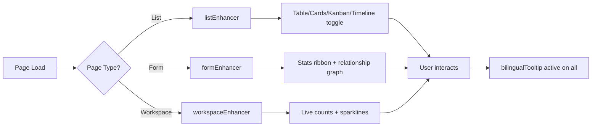

# Auto-Enhancer Pipeline
# سير عمل المحسنات التلقائية

```mermaid
flowchart LR
    A[Page Load] --> B{Page Type?}
    B -->|List| C[listEnhancer]
    B -->|Form| D[formEnhancer]
    B -->|Workspace| E[workspaceEnhancer]
    C --> C1[Table/Cards/Kanban/Timeline toggle]
    D --> D1[Stats ribbon + relationship graph]
    E --> E1[Live counts + sparklines]
    C1 --> F[User interacts]
    D1 --> F
    E1 --> F
    F --> G[bilingualTooltip active on all]
```
