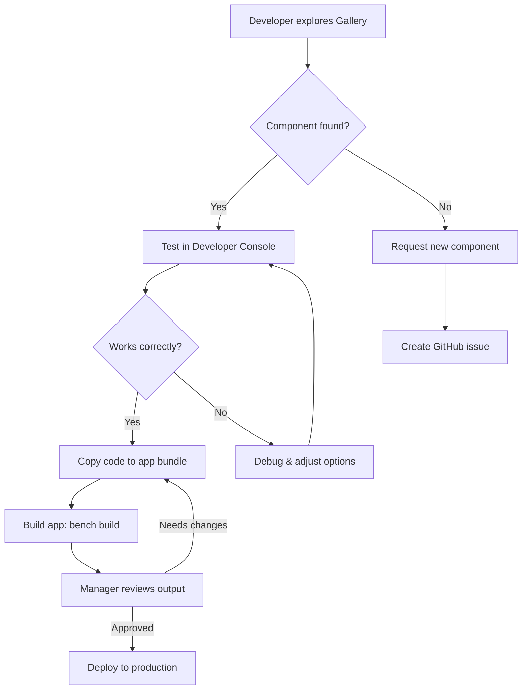

# Component Integration Workflow

# سير عمل دمج المكونات

```mermaid
flowchart TD
    A[Developer explores Gallery] --> B{Component found?}
    B -->|Yes| C[Test in Developer Console]
    B -->|No| D[Request new component]
    C --> E{Works correctly?}
    E -->|Yes| F[Copy code to app bundle]
    E -->|No| G[Debug & adjust options]
    G --> C
    F --> H[Build app: bench build]
    H --> I[Manager reviews output]
    I -->|Approved| J[Deploy to production]
    I -->|Needs changes| F
    D --> K[Create GitHub issue]
```
